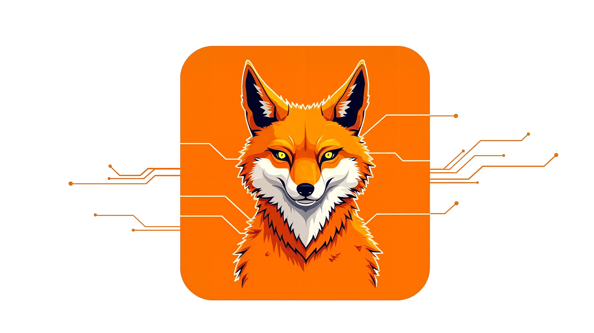

# KISTI AI Platform Team

  
  

Our team at the KISTI Large-scale AI Research Center strives to develop and operate AI models and agent service technologies tailored for the science and technology domain.
In particular, we have developed three key software products: **Dorea-PDF-AI** (an intelligent PDF understanding and retrieval tool), **KISTI MCP** (Model Context Protocol server), and **KISTI SpectraBench** (an intelligent LLM benchmarking system), all of which support the utilization of scientific and technological data as well as AI performance optimization.

Guided by the BLUESKY, the team aims to go beyond learning, advancing toward understanding and evolution to integrate knowledge and drive innovation.

## 📄 KISTI DOREA-PDF-AI (https://github.com/Byun11/Dorea-pdf-ai)
- An intelligent PDF-based ChatBot developed by the AI Platform Team.
- It automates document layout analysis, distinguishing tables, images, and text, with multilingual OCR support (Korean, English, Japanese, Chinese).
- Features include interactive region-based AI conversations, support for OpenAI GPT and local LLMs (Ollama), real-time streaming responses, and conversation history storage.

## 📡 KISTI MCP (https://github.com/ansua79/kisti-mcp/releases/tag/v0.1.7)
- The first MCP (Model Context Protocol)-based server released by KISTI, providing access to science and technology information through OpenAPI integration.
- This version offers seven ScienceON APIs related to papers, patents, and national R&D reports.

## ⚙️ KISTI SpectraBench (https://github.com/gwleee/SpectraBench)
- An intelligent LLM benchmarking tool developed by the AI Platform Team.
- It maximizes evaluation efficiency and stability through machine learning-based optimal scheduling and adaptive resource management.
- Features include performance improvement based on usage, seamless switching between test and production environments, and a three-stage evolution structure (Intelligent → Hybrid → Adaptive).

# What is the BLUESKY?
BLUESKY: Beyond Learning, Understanding & Evolving — Synergizing Knowledge to Yield innovation.
This is the core motto of our team, representing our commitment to advancing beyond learning toward understanding, evolution, and innovation through the synergy of knowledge.

